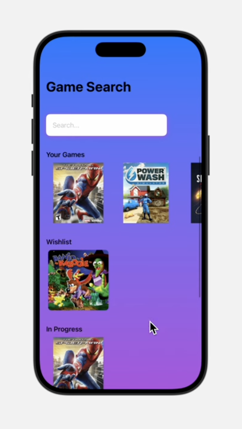
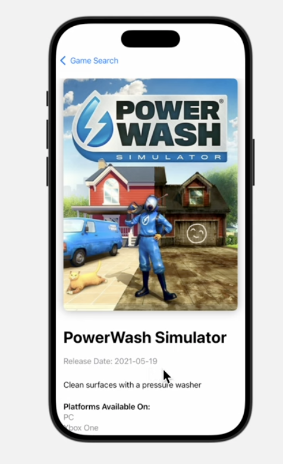
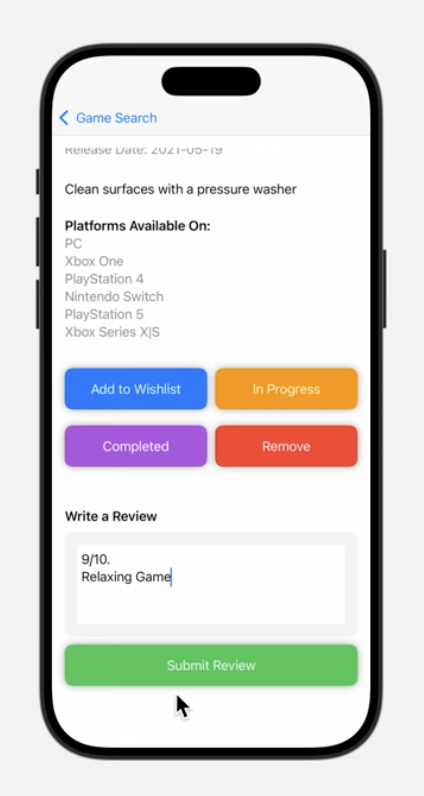

# Game Collection iOS App
### Video Demo: https://youtu.be/4yhuBCTRzt0

### Overview

GameCollection is an iOS app that lets users ***search, organize, and review video games*** in a clean, minimal interface. It’s designed for players who want to track their gaming progress and reflect on completed titles.

### Key Features

* **Game Search (API Structured)** - Search for any game and get structured results including:
    * Cover Image
    * Title
    * Release Date
    * Description
    * Supported Platforms
* **Personal Game Library** - Organize games into categories:
    * My Games
    * In Progress
    * Completed
    * Wishlist
    * (AND MORE)
* **Review System (Unlockable)**
    * Reviews are **only available for completed games**
    * Write and save personalized reviews per game
    * Encourages completion before reflection
* **Clean & Modern UI**
    * Gradient-based design (blue -> purple)
    * Image-focused layout for quick recognition
    * Horizontally scollable game sections

### Tech Stack

* **Swift/SwiftUI**
* Giant Bomb API (game data source)
* ObservableObject for state management

### File Highlights

* **GameService**
    * Handles API communication and filters only relevant game data
* **ContentView**
    * Main entry point with search and categorized game sections
* **GameDetailView**
    * Displays the details of the games, add/remove from categories, write reviews if completed
* **GameSectionView**
    * Renders the categorized game collections in a scrollable layout, **user centered**

### Why This Project?

* Built to solve a real use case: **tracking and reviewing personal games**
* Focus on **intentional data consumption**
* Explores **iOS development with SwiftUI and API integration**
* Emphasizes **UX decisions**

### Future Implementations

* Persistent Memory/Storage
* Social Features (share reviews, friends list)
* App Store official release

# That's All. Thanks!
